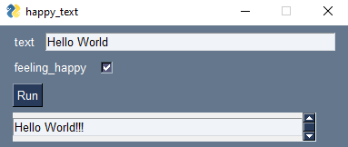
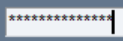
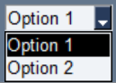

# Guichet
Quickly create simple GUIs in Python.

```python
def happy_text(text: str, feeling_happy: bool):
    if feeling_happy:
        return text + "!!!"
    else:
        return text

gui = Guichet(happy_text)
gui.render()
```
The code above renders the following GUI:



You can also customize the layout by accessing the `layout` attribute of the `Guichet` object.

GUI controls are rendered according to [type hints](https://docs.python.org/3/library/typing.html). Supported types include vanilla Python types (such as `str`, `int` and `float`), types from `typing` (such as `Literal`) and [Pydantic types](https://docs.pydantic.dev/latest/usage/types/types/) (such as `SecretStr`).

The full conversion table is as follows:

| Type hint | GUI control | Rendered as |
| --- | --- | --- |
| `str` | Text input |  |
| `int` | Text input |  |
| `float` | Text input |  |
| `bool` | Checkbox |  |
| `pydantic.SecretStr` | Password input |  |
| `typing.Literal` with args (for example `Literal["Option 1", "Option 2"]`) | Dropdown |  |

Guichet is based on the awesome [PySimpleGUI](https://www.pysimplegui.org/) library.

## Installation
```
pip install guichet
```

## Main API
```
Guichet(
    main_function: Callable,
    title: str = None,
    output_size: tuple = (80, 20),
    button_label: str = "Run",
    theme: str = "Dark Blue 3",
    show_default: bool = True,
    ignore_params: list = None,
    redirect_stdout: bool = True,
    run_in_new_thread: bool = False,
    wait_message: str = "Please wait...",
    refresh_time: int = 1000,
    window_param: str = None,
)
```

- **main_function** (Callable): The function in which the GUI is based on.
- **title** (str, optional): The window title. Defaults to `None`, which means the name of the `main_function` will be used.
- **output_size** (tuple, optional): The size of the output field, which indirectly sets the size of the window. Defaults to `(80, 20)`.
- **button_label** (str, optional): The label of the button that calls `main_function`. Defaults to `"Run"`.
- **theme** (str, optional): The window theme. You can explore the list of available themes following these [instructions][1]. Defaults to `"Dark Blue 3"`.
- **show_default** (bool, optional): Whether to show the default values of the parameters in the GUI. Defaults to `True`.
- **ignore_params** (list, optional): Parameters to be ignored and not shown in the GUI. Defaults to `None`.
- **redirect_stdout** (bool, optional): Whether to redirect the standard output to the GUI's output field. If `True`, regular `print` calls in `main_function` will write to the output field. Defaults to `True`.
- **run_in_new_thread** (bool, optional): Whether to run the `main_function` in a new thread. This should only be `True` if the `main_function` is slow and you want to avoid blocking the GUI. Read the docs as some caveats apply when running a function in a separate thread. Defaults to `False`.
- **wait_message** (str, optional): The message to be shown in the output field.
when a users presses the running button and the function has not yet
finished. Applicable only if `run_in_new_thread` is `True`.
Defaults to `"Please wait..."`.
- **refresh_time** (int, optional): Time (in milliseconds) for the window to check again for new events. Useful only in advanced scenarios where `run_in_new_thread` is `True`. Use the highest value you can afford. Defaults to `1000`.
- **window_param** (str, optional): The parameter of the `main_function` to where the GUI's main window object will be passed. Needed only in advanced scenarios where the `main_function` needs to communicate with the GUI. The parameter passed to `window` will not be shown in the GUI. Defaults to `None`.

[1]: https://www.pysimplegui.org/en/latest/cookbook/#themes-window-beautification
